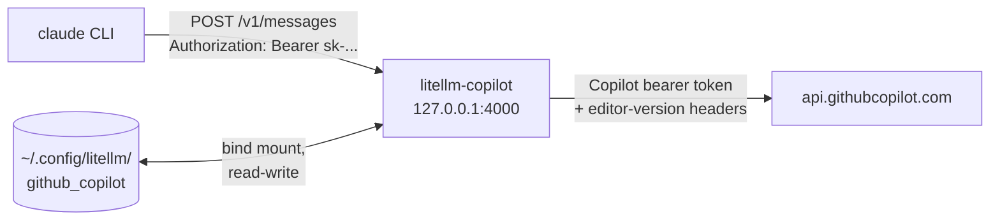

# Run Claude Code on GitHub Copilot models through LiteLLM

The Claude Code CLI talks the Anthropic Messages API and nothing else. LiteLLM speaks that API on
`/v1/messages` and forwards to any provider it supports, GitHub Copilot included. Run LiteLLM in
Docker on port 4000, point the CLI at it, and your Copilot subscription pays for the tokens.



Claude models get the good path. LiteLLM sees `github_copilot/claude-*` on `/v1/messages` and routes to
Copilot's own Anthropic-format endpoint, so tool calls, thinking blocks and `anthropic-beta` headers
pass through untouched. Ask for a GPT or Gemini model and LiteLLM translates to `/chat/completions`
instead, which works but drops Anthropic-only features.

> [!IMPORTANT]
> Read this before you start. LiteLLM authenticates with the VS Code Copilot OAuth client ID and sends
> `editor-version: vscode/...` headers, so GitHub sees these requests as an editor plugin. That is
> outside the GitHub Copilot terms for most plans. Check your own agreement. Separately, Claude Code is
> chatty: a single session fires hundreds of requests, and every one against a premium model burns a
> premium request from your monthly quota.

## What you get

| File | Purpose |
|---|---|
| `setup.sh` | Authorizes with GitHub, starts the gateway, proves Copilot answers. Idempotent. |
| `docker-compose.yml` | The gateway. Port 4000 on loopback, config and token bind mounted. |
| `config.yaml` | The model list. Edit this to add or rename models. |
| `claude-copilot.sh` | Launches `claude` wired to the gateway. |
| `copilot_login.py` | Runs the device flow in a throwaway container. Called by `setup.sh`. |
| `.env` | Generated. Holds the gateway master key. Never commit it. |

Everything runs in Docker. There is no Python virtualenv and nothing is installed on the host.

## Prerequisites

- An active GitHub Copilot subscription on the account you authorize.
- Docker Desktop running, with the `docker compose` plugin.
- Claude Code 2.1.129 or later, so `/model` can list what the gateway serves.
- Port 4000 free. `setup.sh` refuses to start if something else holds it.
- No `ANTHROPIC_API_KEY` in your shell profile. It reaches the gateway in the wrong header and returns 401.

## Step by step

### 1. Run the setup script

```bash
cd ~/code/litellm
./setup.sh
```

It writes a random master key to `.env`, then runs the GitHub device flow in a throwaway container and
prints something like:

```
Please visit https://github.com/login/device and enter code ABCD-1234 to authenticate.
```

Open that URL, enter the code, approve the request. The script then starts the gateway, waits for the
container to report healthy, and sends a real prompt to Copilot. It only claims success when Copilot
answers.

> [!WARNING]
> The device flow polls for 60 seconds and then gives up. If you miss the window, run `./setup.sh`
> again. It skips the steps that already finished.

### 2. Launch Claude Code

```bash
./claude-copilot.sh
```

That is the whole workflow. The gateway has `restart: unless-stopped`, so it comes back with Docker and
you only run `setup.sh` again if you change something.

## How the Copilot credentials reach the container

This is the part that breaks if you get it wrong, so it is worth understanding.

When LiteLLM loads a `github_copilot` model it resolves a Copilot key during startup. With no cached
token it runs the OAuth device flow inline: the code goes into the container log where you will not see
it, the poll window is 60 seconds, and the port never opens until the flow finishes or fails. A restart
repeats the whole thing.

So `setup.sh` authorizes first, in a throwaway container that shares one bind mount with the gateway:

```yaml
- ${HOME}/.config/litellm/github_copilot:/root/.config/litellm/github_copilot
```

Two files land there. `access-token` is the long-lived GitHub OAuth token. `api-key.json` is the
short-lived Copilot key, and the gateway rewrites it in place whenever it expires. The mount is
read-write precisely so that refresh survives a container recreate, which is why you authorize once and
never again.

Verify what the gateway is holding:

```bash
ls -l ~/.config/litellm/github_copilot/
docker compose logs litellm | grep -i "login/device"   # any output means it wants authorization
```

## Verify the chain yourself

Include `output_config`. Claude Code sends it on every request, and leaving it out is what makes a
hand-run `curl` pass while every real session fails:

```bash
cd ~/code/litellm && set -a && . .env && set +a
curl -sS -X POST http://127.0.0.1:4000/v1/messages \
  -H "Authorization: Bearer $LITELLM_MASTER_KEY" \
  -H 'content-type: application/json' \
  -H 'anthropic-version: 2023-06-01' \
  -d '{"model":"copilot-opus","max_tokens":32,
       "output_config":{"effort":"high"},
       "messages":[{"role":"user","content":"Say ready."}]}'
```

A body with `"type": "message"` and a `content` block means the whole chain works. Fix any failure here
before involving the CLI, because the CLI hides the response body.

The end-to-end check is one non-interactive session:

```bash
./claude-copilot.sh -p "Reply with exactly: gateway works"
```

Inside a session, run `/status`. The Auth line must name `ANTHROPIC_AUTH_TOKEN`, not a claude.ai
account. Then run `docker compose logs -f litellm` and watch requests arrive as you type.

## What the launcher sets

`claude-copilot.sh` exports five variables and execs `claude`:

| Variable | Value | Why |
|---|---|---|
| `ANTHROPIC_BASE_URL` | `http://127.0.0.1:4000` | The CLI appends `/v1/messages` itself. |
| `ANTHROPIC_AUTH_TOKEN` | your master key | Sent as `Authorization: Bearer`, which is what LiteLLM reads. |
| `ANTHROPIC_DEFAULT_OPUS_MODEL` | `copilot-opus` | What the `opus` alias resolves to. |
| `ANTHROPIC_DEFAULT_SONNET_MODEL` | `copilot-sonnet` | What the `sonnet` alias resolves to. |
| `ANTHROPIC_DEFAULT_HAIKU_MODEL` | `copilot-haiku` | The `haiku` alias, and all background work. |
| `CLAUDE_CODE_MAX_CONTEXT_TOKENS` | `200000` | The CLI does not recognise these names, so it would guess and warn. |

Those three model variables are what actually forces Copilot to serve every request. Without them the
CLI asks for Anthropic model IDs the gateway does not have, and each request fails.

It also sets `CLAUDE_CODE_ENABLE_GATEWAY_MODEL_DISCOVERY=1`, so the CLI calls `GET /v1/models` at
startup and adds each model to the `/model` picker under "From gateway". The wildcard entry expands
there, so the picker lists the five short names plus all 39 models Copilot serves.

## Choosing models

| Name | Backing model | Window |
|---|---|---|
| `copilot-opus` | `github_copilot/claude-opus-5` | 200k in, 64k out |
| `copilot-sonnet` | `github_copilot/claude-sonnet-5` | 200k in, 64k out |
| `copilot-haiku` | `github_copilot/claude-fable-5` | 200k in, 64k out |
| `copilot-gpt` | `github_copilot/gpt-5.4` | 272k in, 128k out |
| `copilot-gpt-mini` | `github_copilot/gpt-5-mini` | 128k in, 64k out |

All five are current-generation models that accept `output_config.effort`. That is a requirement, not a
preference: see [Effort and model generations](#effort-and-model-generations).

The `github_copilot/*` entry in `config.yaml` means any Copilot model works by its real name without a
config edit:

```bash
./claude-copilot.sh --model github_copilot/claude-opus-4.8
```

To conserve premium requests, move background traffic to a model your plan includes:

```bash
COPILOT_HAIKU_MODEL=copilot-gpt-mini ./claude-copilot.sh
```

That is worth doing. Background calls generate session titles and file summaries, and paying premium
rates for them adds up fast.

After editing `config.yaml`, apply it with `docker compose restart litellm`.

## Effort and model generations

Claude Code puts `output_config.effort` in the body of every request. Copilot's native Anthropic
endpoint validates that field per model, and the 4.5 generation rejects it outright:

```
400 output_config.effort "high" was provided, but model claude-opus-4.5
    does not support reasoning effort  [invalid_reasoning_effort]
```

The same request without `output_config` succeeds against `claude-opus-4.5`, so a plain `curl` test can
pass while every real session fails. That trips you up if you test the gateway by hand first.

The fix is to use a model that supports reasoning effort, which is what `config.yaml` now does. Measured
against this account:

| Model | With `effort` |
|---|---|
| `claude-opus-5`, `claude-opus-4.8` | works |
| `claude-sonnet-5`, `claude-sonnet-4.6` | works |
| `claude-fable-5` | works |
| `claude-sonnet-4.5`, `claude-haiku-4.5` | works, though Copilot does not advertise `reasoning_effort` |
| `claude-opus-4.5` | rejected |
| `claude-opus-4.8-fast`, `claude-opus-4.6-fast` | not granted to this integrator |

### Checking a model

Which models your Copilot subscription grants is account-specific and changes over time, so check rather
than assume. List what your token is allowed to use, with the capabilities Copilot reports:

```bash
docker exec litellm-copilot /app/.venv/bin/python -c "
import json, urllib.request
d = json.load(open('/root/.config/litellm/github_copilot/api-key.json'))
req = urllib.request.Request(
    d['endpoints']['api'].rstrip('/') + '/models',
    headers={'Authorization': 'Bearer ' + d['token'],
             'editor-version': 'vscode/1.98.0',
             'Copilot-Integration-Id': 'vscode-chat'})
for x in json.load(urllib.request.urlopen(req, timeout=20))['data']:
    caps = x.get('capabilities', {}) or {}
    supports = caps.get('supports', {}) or {}
    if 'reasoning_effort' in supports:
        print(x['id'], caps.get('limits', {}).get('max_prompt_tokens'))
"
```

Then confirm a candidate the way Claude Code actually calls it, with `output_config` included:

```bash
set -a && . .env && set +a
curl -sS -X POST http://127.0.0.1:4000/v1/messages \
  -H "Authorization: Bearer $LITELLM_MASTER_KEY" \
  -H 'content-type: application/json' -H 'anthropic-version: 2023-06-01' \
  -d '{"model":"github_copilot/claude-opus-5","max_tokens":16,
       "output_config":{"effort":"high"},
       "messages":[{"role":"user","content":"hi"}]}'
```

## Gateway controls

```bash
docker compose logs -f litellm          # follow the request log
docker compose ps                       # health status
docker compose restart litellm          # after editing config.yaml
docker compose down                     # stop and remove the container
docker compose up -d                    # start it again
```

The container is named `litellm-copilot` under the compose project `litellm-copilot`, so it does not
collide with any other LiteLLM deployment.

## Make it permanent

Two options. I recommend the alias, because `ANTHROPIC_BASE_URL` in your user settings also disables
Remote Control and voice dictation, and every session then fails when the gateway is down.

**Shell alias.** Add to `~/.zshrc`:

```bash
alias claude-copilot="$HOME/code/litellm/claude-copilot.sh"
```

**Always on.** Move the variables into the `env` block of `~/.claude/settings.json`:

```json
{
  "env": {
    "ANTHROPIC_BASE_URL": "http://127.0.0.1:4000",
    "ANTHROPIC_AUTH_TOKEN": "sk-your-master-key",
    "ANTHROPIC_DEFAULT_OPUS_MODEL": "copilot-opus",
    "ANTHROPIC_DEFAULT_SONNET_MODEL": "copilot-sonnet",
    "ANTHROPIC_DEFAULT_HAIKU_MODEL": "copilot-gpt-mini",
    "CLAUDE_CODE_ENABLE_GATEWAY_MODEL_DISCOVERY": "1"
  }
}
```

That puts a live credential in a plaintext file. Delete the block to go back to your claude.ai login.

## Troubleshooting

| Symptom | Cause | Fix |
|---|---|---|
| `required variable LITELLM_MASTER_KEY is missing` | No `.env` yet | Run `./setup.sh`. |
| The container never reports healthy and the log shows a device code | No cached Copilot token | `docker compose down`, run `./setup.sh`, finish the flow. |
| `400 invalid_reasoning_effort ... does not support reasoning effort` | The model predates `output_config.effort` | Point the alias at a current model. See [Effort and model generations](#effort-and-model-generations). |
| `400 Authorization header is badly formatted` | Copilot rejected the token | The cached token is stale. `rm -rf ~/.config/litellm/github_copilot/*` and re-run `./setup.sh`. |
| `The requested model is not available for integrator "vscode-chat"` | Your account is not granted that model | List what you have with [Checking a model](#checking-a-model). |
| `claude.ai connectors are disabled ...` on startup | Expected | A gateway credential replaces your claude.ai login. Harmless. |
| `401` from the curl test | Key sent in the wrong header | Use `Authorization: Bearer`, not `x-api-key`. Confirm `ANTHROPIC_API_KEY` is unset. |
| `Connection refused` on 4000 | Gateway not running | `docker compose up -d`. |
| The CLI opens the login screen | Credential variable not set | Launch through `./claude-copilot.sh`, then check `/status`. |
| `BadRequestError: model not found` | Name absent from `config.yaml` | Use a name from the table, or the full `github_copilot/...` form. |
| `403` with a Copilot policy message | Model not enabled for your account | Enable the model's policy in GitHub Copilot settings, or pick another. |
| Port 4000 already in use | Another gateway or container | Stop it, or change both sides of the port mapping in `docker-compose.yml`. |
| The `/model` picker shows only Anthropic models | Discovery off, or the CLI is too old | Set `CLAUDE_CODE_ENABLE_GATEWAY_MODEL_DISCOVERY=1` and upgrade to 2.1.129 or later. |

For the outbound request and the raw Copilot response, add `--detailed_debug` to the `command` list in
`docker-compose.yml` and restart.

## Sources

- [LiteLLM: GitHub Copilot provider](https://docs.litellm.ai/docs/providers/github_copilot)
- [LiteLLM: /v1/messages](https://docs.litellm.ai/docs/anthropic_unified/)
- [LiteLLM: Claude Code with non-Anthropic models](https://docs.litellm.ai/docs/tutorials/claude_non_anthropic_models)
- [Claude Code: connect to an LLM gateway](https://code.claude.com/docs/en/llm-gateway-connect)
- [Claude Code: environment variables](https://code.claude.com/docs/en/env-vars)
